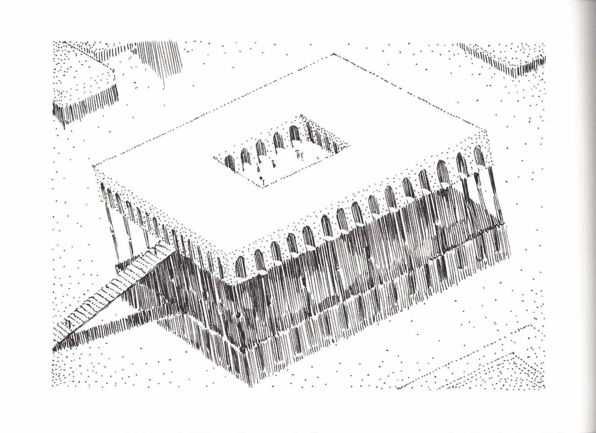
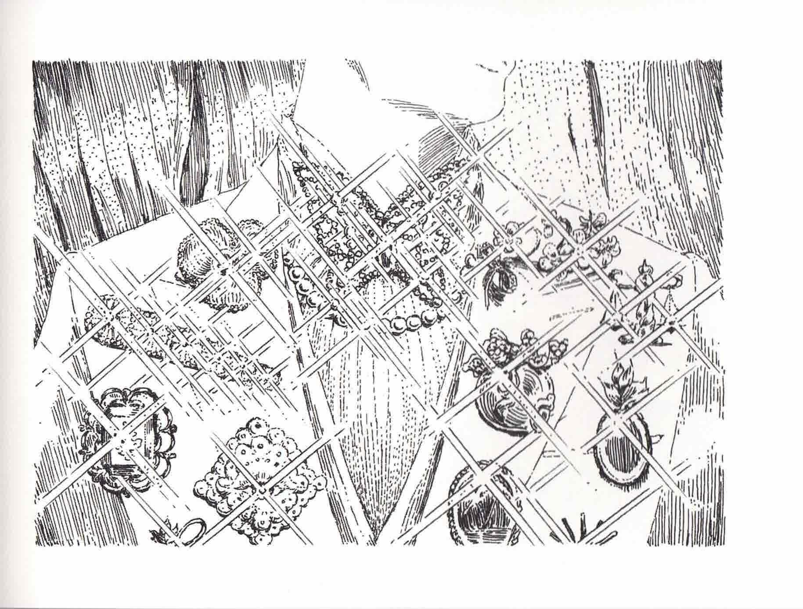

# Explanatory Notes

凡例

一, 本書は、未知の領域から受け取った書籍データを解凍・翻訳 再現したものである。

一, 言語は部分的に解読不能で、現時点での正確性を優先した翻訳である。

一, 翻訳にあたっては多少文章としてぎこちない印象を与えても意味が違(たが)わぬよう加える部分は最小に留めた。

一, 訳語は統一性よりも正確性を優先した。

一, 画像記録は劣化のため色彩データがない、あるいは元々モノクロだった可能性がある。

Explanatory Notes

一, This book is a decompression, translation, and reproduction of book data received from an unknown source.

一, The language is partially indecipherable, and the translation prioritizes accuracy at this time.

一, In translating the text, the additions were kept to a minimum so that the meaning would not be lost even if the text appeared a little awkward.

一, Accuracy was prioritized over uniformity in the translation.

一, Image records may be missing color data due to deterioration or may have originally been black and white.

# Poem

繰り返し 戻らない ダンスをしながら

球根植物が燃え尽きるのを

待っている

While dancing repeatedly

Bulbs burn out 

Waiting

# Ladra

誰もが知っているように、 我々には振り返りたくない過去がある。

またその上に作った非常に長く退屈な平和のため､

あらゆる記録は消費の他には顧みられず、

懐古的情緒すら持ち合わせていないことは誰も承知である。

しかしこの度私たちは新しい仲間を迎えることになった。

この大きな契機に私は彼らがいる風景を記録しておきたい。

約束された終わりに向かう一万年の中の

ある日のパーティーの記録をいとしい仲間に捧げる。

愛を込めて       ラドラ

As we all know, we have a past we don't want to look back on.

Also because of the very long and tedious peace we have made over it.

All records are neglected except for consumption,

We all know that we do not even have nostalgic sentiments.

But now we have new friends.

I would like to take this great opportunity to record the landscape they are in.

Of 10,000 years toward the promised end.

I dedicate this record of one day's party to my dear friends.

With love, Ladra

# Padparadscha 1

一　読書中にごめん。 この本面白そうだ。

昼寝中と、 興味深い初期宇宙の科学的な見解。

一　Sorry, I’m reading. This book sounds interesting.

Napping and an interesting scientific view of the early universe.

一　夢を見た?

おまえは結局怠け者と薔薇(ばら)に言われる夢を見た。 それは本当に本当。

一　Did you have a dream? 

I ended up having a dream where you were called lazy by a rose. It’s really true.

一　いま君がベッドにしてる診療所顧客へのアフターケアは評判だよ。 優しく的確なアドバイスと共に。

怠け者の元宝石は珍しいだけ。 名医の診察は手厳しい。

一　The clinic you're bedding now has a reputation for aftercare for its clients. With gentle and precise advice.

Lazy former gems are just rare. A good doctor’s visit is just tough. 

一　アイスは食べ頃?

客の土産(みやげ)。 昼寝してしまった。 昨日は蜂蜜ミントティー､ラベンダーケーキ､ 霧のフライ。

一　Is it time for ice cream?

A souvenir from a client. I took a nap. Yesterday I had honey mint tea, lavender cake, and fog fries.

一　お気に入りは。

ロータスチップス。 サーティの店のもの。

一　And your favorite. 

Lotus Chips. From Thirty’s.

一　顧客はどんな会話を。

天気の話。 気分の話。 恋人の話。 さっきは最も奥の幻の話。 ひみつの境目は気分によって変わる。

一　What did your clients talk about.

About the weather. They talk about their moods. They talk about their lovers. Earlier, they were talking about the deepest illusion. The boundary of the secret depends on the mood.

# Padparadscha 2

一　君の穴を撮ってみたかった。

みんな見たがる。 ひとつ残してもよかった。

一　I wanted to photograph your holes.

Everyone wanted to see it. I could’ve left one behind.

一　今夜始まるパーティーで。

おそらく。

一　The party’s starting tonight.

Probably.

# Antarcticite

一　時間まで海で?

待ち合わせ。

一　Why are you at the sea at this hour? 

Meeting up.

一　新しい合成海は気に入ってる ?

とても。あたたかい。体は溶けない。

一　Do you like the new synthetic sea? 

Very. It’s warm. My body doesn’t melt. 

ー　おすすめの海遊びは。

サーフィン。 ただ浮かぶのも沈むのも良い。黒い空と太陽も。

一　Recommended activities for the sea? 

Surfing. It’s also good to just float or sink. Black sky and sun and all. 

一 　彼は?

いつもの地下で祈り。 効力はないが自由。

一　And him? 

Praying in his usual basement. It’s ineffective but he’s free.

# Cinnabar

ー　やあ、シンシャ。 お邪魔しよう。

いらっしゃい。ブルーゾに?

ー　Hey, Shinsha. I’m going to disturb you now. 

Welcome. For Bluezo?  

ー　本日のパーティー記録のための徘徊。

それならメインは納品が済んでしまった。会場で逢って。お土産用箱の堇(すみれ)ならそこに。

アメシスト製クッキーと一緒にするためのサンプル。

 ー　I’m here to record today’s party.

Well, then, I've already delivered the main course. Meet me at the venue. If you're looking 

for a souvenir box, there's a violet one there. 

A sample to go with the amethyst cookies.

ー　とても可憐だ。君も来るだろ ?

ウェレガトがドレスを用意してしまったので。

ー　They’re very pretty. You’re coming too, right? 

Welegato has prepared a dress for you.  

ー　偏屈な、 植物園所属の昆虫専門学者は僕が連れてくるからね。

ああ。うん。 どうしてそれを。

ー　Eccentric, I’ll bring the entomologist from the Botanical Gardens. 

Yeah. Oh. How did you know about that?

ー　花の仕事はどう?

花は好きだ。ずっと。毒素の排出がなくなり触れても傷まなくなってうれしい。

ー　How's the flower business?

I like flowers. Always have. I'm glad they're not toxic anymore, and they don't hurt when I touch them.

ー　薔薇を頂こう。 その薄く煙った土星紫のものをありったけ。

最新で最古のミステリアスなフレーバー。ブルーゾの好み。きっと。

ー　I’ll take a rose. All that thin, smoky, saturn-purple stuff.

The newest, oldest, most mysterious flavor. Just the way Bluezo likes it. I'm sure.

# Blue Zoisite

―　記録に詩をつけてほしい。

やだ。

―　I want you to put a poem on the record.

No.

―　君の詩は素晴らしい。

眠る方がいい。

―　Your poems are wonderful.

I'd rather sleep.

―　そうだね。気が変わったらお願い.

わかった.

―　Agreed. Let me know if you change your mind.

Understood. 

# Euclase

一　ゃぁ叡智(えいち)、ご機嫌ぃかが。

こんにちは。とてもいい日ね.

一　Hey Wisdom, how are you today? 

Good afternoon. It's a beautiful day.

―　忙しいかと試(たず)ねるのは愚かだ。今日の会議の数は？

21。あと14ね。

―　It's silly to ask if you're busy. How many meetings are there today?

21, 14 to go.

ー　パーティーは間に合う？

ええ。楽しみにしているわ。お昼は食べすぎないようにね。

―　Will you be back in time for the party?

Yes. I'm looking forward to it. Don't eat too much at lunch.

―　ランチの予定詳細について。

サンドイッチ。シェードの作品。具材詳細は彼に訊ねて。予想はスモークサーモン、クリー 

厶チーズ、オニオン、フェンネル、レモン。この100日のデータ予測。答え合わせをお願い。

―　Tell me the details about the lunch plans.

Sandwiches. Jade's work. Ask him for details on ingredients. Forecast is smoked salmon,

 cream cheese, onion, fennel, lemon. Data projections for the last 100 days. Please check your answers.

―　まかせて。この新研究寺院は美しいね。

みんなが幸せになれるように。

―　I'm on it. This new research temple is beautiful.

I wish you all the best.

―　及ばなかった仲間がいると聞いた。

残念ながら、基準値まで蒸発した記憶が揃(そろ)わなかった若干名。全てを救うことは限りなく

困難だけど、可能な限りは、終わりの日まで。

―　I heard there were a few of you who didn't make it.

Unfortunately, there are a few whose memories didn't evaporate to the threshold. It's infinitely more difficult to

 save them all, but as long as it's possible, until the end of time. 

# Jade

―　議長、忙しい？

前よりも。それは以前の役職。今は補佐をしている。

―　Chairman, are you busy?

More than before. That was my old position. Now I'm an assistant.

―　仕事は好み？

元々彼の方が能力は優れている.優位はかつての身体的性質のみである。ユークレースが 

正当な評価を受けてとても嬉(うれ)しい。彼をサボートできるのも。

―　Do you prefer the job?

He was always better at what he does, and the only advantage he has is his former physical nature. I'm very happy that Euclase

is getting the recognition he deserves. And that we can support him.

一　美しい院だ。

そこは、地上寺院の水棲(すいせい)植物を移植した。三日、稀有(けう)な花を咲かせた。順調に育てばボル 

ツは幼体クラゲを暮らさせるだろう。

一　It's one beautiful temple.

There, the water-dwelling (aquatic) plants of the ground temple were transplanted here. Three days later, it produced a rare flower. If it grows well, 

Bortz will let the juvenile jellyfish live.

―　懐旧と安らぎの再現？

純粋な思い出として。閉塞に満ちた苦しい時代は過ぎ、元には戻れないし誰も望まない。 

今は全てが美しく正しい。少なくとも私にとっては。

―　Is this a recreation for nostalgia and comfort?

As pure memories. The hard times, filled with stagnation, have passed, and there is no going back, and no one wants that. 

Everything is beautiful and right now. At least for me.

―　サンドイッチの具材について。

スモークサーモン、クリームチース、オニオン、フェンネル、レモノ。そして、決して忘 れてはいけないのは、彼のリラックスを担うギプソフィラの香りのアイスティー。

―　About the sandwich ingredients.

Smoked salmon, cream cheese, onion, fennel, lemony. And never forget the Gypsophila scented iced tea that is responsible for his relaxation.

# Sensei 1

一　仕事の邪魔でなければ。

これは業務ではない。非合理的で生産性のない祈り。

一　If it doesn't get in the way of your work.

This isn’t business. This is just irrational and unproductive praying.

一　毎日ここで？

代表公務員と寺院長が私の計算処理を必要とする時以外は許されている。私はただの喪失 

した技術計算機に戻り道具として役立つことに安定して安堵(あんど)する。

一　Here every day? 

It’s allowed, except for when the head official and the temple director need my computational processing. I find a steady relief in returning to being just a lost technical calculator and serving as a tool.

一　祈りの内容が知りたい。

地上の幸福。私に平等は成し遂げられず安寧、生命の襞(ひだ)の沈殿物を取り除けますように。 

一　I would like to know the contents of the prayer.

Happiness on earth. May I not achieve equality, may I not achieve peace, may I not remove the sediments of the folds of life.

一　ホモ，サピエンスは幸福をどう捉えていたのか知っているか？

愛、自由、富等様々な現象の相対的複合的評価として捉え、同時に、幸福の中に不幸を見 

つけ過大評価することに費やした。社会成長を盲信の性質上、多くの他者比較を必要とし

 た。それらは不安の排除という種の危機管理性質で免れることができなかった。多くの人 

間は賢かったが大衆になると変容し制御できない影の大波となる。組織は、群衆にとって 

は喫緊、素朴で本能による反射的な望みの類、即ち、目前の課題にのみ力を費やし、長期 

的な幸福に有効な視点計画を持つことが能わなかった.短期的な正義の勝利によって新た

 な不幸の腫瘍創出が観測される。真の和平、平等、幸福を目指しながらも、これら繰り返 

す波の浸食を防げなかった。

―　Do you know how homosapiens understood happiness?

They saw it as a relative composite evaluation of various phenomena such as love, freedom, wealth, etc. 

At the same time, they spent a lot of time finding misery in happiness and overestimating it. 

The blind faith nature of social growth required many peer comparisons. 

They could not be spared by the crisis management nature of the species, the elimination of insecurity. 

Many people were smart, but when they became the masses, they became a shadowy wave that could not be transformed or controlled. 

Organizations were focused only on the immediate task at hand, the kind of immediate, naive, instinctive, and reflexive desire of the masses, 

and were incapable of having an effective perspective plan for their long-term wellbeing. The triumph of short-term justice has created a new tumor of unhappiness. 

The goal of true peace, equality, and happiness has not prevented the erosion of these recurring waves.

# Sensei 2

ー　なるほど確かに僕らの祖だ。同胞よ、君の考える幸福は?

他者との比較から離れること。無明な妄想を断つこと。執着を捨てること。苦悩と共にあ

ること。命と命の輪郭の間、その余白を清潔に保つこと。

ー　I see, those are indeed our ancestors. What is your idea of happiness, my fellow brethren? 

To be free from comparison. To renounce ignorant delusions. To renounce obsessions. 

To be with suffering. To keep clean the space between life and the contours of life.

ー　たしかに独歩と博愛は理想だ。一方、彼が海で待ってる 。

約束の時間はまだ。

ー　Indeed, independence and philanthropy are ideals. On the other hand, meanwhile he’s waiting for you at the sea.

The promised time has not yet come.

ー　彼は待っているよ。

理解した。私は未だ生命体の心理に起因する抒情（じょじょう）把握について根本的欠如がある。教え

てくれてありがとう。

ー　He’s waiting for you. 

I still have a fundamental lack of lyrical grasp due to the psychology of living beings. Thank you for the lesson. 

# Hemimorphite

一　ヘミモル、 いつもいい場所を知ってるね。

そう、でしょう？　教えられた。ここに新フローズンは昨日知って今日是非だった。新し

いお土産をありがとう。

一　Hemimorph, you always know the best spots. 

It seems so, doesn’t it? I was taught. The new Frozen here was a must today, learned about it yesterday. 

Thanks for the new souvenir.

ー　どういたしました。 最近はどう？

嬉しい気分。親切で、色んな新しい場で、みんなで遊ぶ。その繰り返し。一万年ずっとな

ら尚更（なおさら）。考えることはない。

ー　Thank you very much. How are you?

I'm happy. Kindness, new places, new people, new things to play with. It's a cycle.

Especially if it's been going on for 10,000 years. I don't think about it.

ー　センサー、これからの流行は？

皆が訊（き）くのに、自分にわからない。今好きな物、薄いパープルのシャワー、オーガンジー、

シルバーのグラス、オレンジの水着、ピンクマッシュルームのドリンク、

透明なレモンクリーム、ハスの実のロースト、確かな湿度計、正確ではない時間。

ー　Sensor, what's the new trend?

Everyone asks me, but I don't know. What I like right now: pale purple showers, organza, 

silver glasses, orange swimsuits, pink mushroom drinks, clear lemon cream, roasted lotus seeds,

 reliable hygrometers, inaccurate (imprecise) time.

ー　今夜のパーティーはもちろん君の好みだよね。

最高の楽しみ! 今週はそのことでいっぱい。

ー　Tonight's party is, of course, your kind of party.

The best kind of fun! This week is full of it.

# Watermelon Tourmaline

ー　このサンデーをどうぞ、ウォーター。

わお、ありがとう！　これはヘミモルと話していた、そのものだって。

ー　Here's a sundae for you, Water.

Wow, thank you! This is exactly what I was talking about with Hemimorph.

ー　今日はどんなイメージ？

今日も大体いいイメージ。空は黒、ここは貝殻の内側の色。地上は薄く遠くなった。

ー　What kind of image do you have today?

Today is another good day. The sky is black, here is the color of the inside of a shell. The earth is thin and far away.

ー　地上を思い出している？

うーん。どれがいい？

ー　Do you remember the earth?

Mmm-hmm. Which one do you prefer?

ー　最も残っていること。

友達の破片をしまいこんだ日のこと。 金剛（こんごう）のためのお祝い日のこと。空は青く、雲は冷た

く、すべての花が開いていた。とても、とても思い出の映像。何もわかってなかったこと

も。今は何もなく、すべての日がたのしいから。どちらかが夢。

ー　The one I remember most.

The day I put away the pieces of my friend. The celebration day for Kongo. 

The sky was blue, the clouds were cold, and all the flowers were open. Very, very memorable images. 

And that I didn't know anything about it. Because now there is nothing, and every day is a pleasure. Either one is a dream.

ー　今日のパーティーは楽しいだろうね。

うん。ぜったい。たのしみ。

ー　I bet you’ll have a good time at the party today, won't you?

Yes, it will be. I'm sure it will be. I'm looking forward to it.

# Diamond

ー　ハイ、 宇宙一の偶像。ごきげんいかが。

カメラ天才センスの登場を、聞いてないわ。夜の娯楽ショーを撮ってくれるの？

ー　Hi, the greatest idol in the universe. How’s it going.

I didn’t hear that the camera genius was coming. Are you going to shoot the night show? 

ー　宵闇開始のパーティー記録だ。

ライブの後に行くわ。遅刻の予定。リラックスの楽しみ。

ー　I'll be recording the party at the start of the evening.

I'll be there after the show. I'm going to be late. Relaxing fun.

ー　クラゲ研究者の弟を勧誘結成の噂（うわさ）について。

限定的にそうしたいのだけど彼の許諾が難航している。でも諦めない。

ー　Regarding the rumor of recruiting your brother, a jellyfish researcher, to form a group.

I would like to do so on a limited basis, but it’s difficult getting his permission. But I'm not giving up.

ー　銀河の輝きが増すことに期待している。 これは月市民みんな。

その通り。そして自分も更なる成長を遂げる予定。ー緒が幸福ではない、でもまた会った。

それに意味を持たせたいのは贅沢（ぜいたく）かしら。そして、今、この装置が完成したら撮ってほし

 いのだけど。可能？

ー　I'm looking forward to seeing the galaxy shine brighter. This is for all the citizens of the Moon.

Thats right. And I plan to grow even more. - I’m not happy, but we have met again. 

I wonder if it's a luxury to want to give it meaning.

 And when this device is finished, I want you to take a picture of it. Is that possible? 

ー　もちろん。そこに光り、佇（たたず）んで。

セット！　物質的に失われた反射光を出すわ。

ー　Of course. There it is, shining, standing.

The set!　It reflects the light that was physically lost.  

# Alexandrite

一   偉大なシIフ、今晩は君の作品かな。

今日のパーティーは当番じゃないの。

一　Great shifu, I guess this evening is your work.

I’m not on duty at today’s party.

一　君の登場はいつ頃？

二週の後。これから多くのパーティーはいいけど、毎週の新メニューは忙(せわ)しない。今日は 

アメシスト.サーティの出番。相談に乗った。楽しみにして。間違いない。

一　When is your appearance?

Two weeks from now. I'm happy to be on duty for many parties in the future, but I'm not busy with a new menu every week.

 Today is Amethyst. Thirty's turn. I've consulted with them. Looking forward to it. I'm sure you are too.

一　注目は。

パイナップルケーキ。シナモンとジンジャーの配合が絶妙。ところで、ランチ定食でいい？

一　The highlight is…

Pineapple cake. A perfect combination of cinnamon and ginger. By the way, can I have the lunch set menu?

—　ありがとう！ 休憩中では？

午後に向けての準備運動。

—　Thank you! I thought we were taking a break.

Getting ready for the afternoon.

# Benitoite

ー　かわいいウェイターさんこんにちは。

こんにちは。いい天気だね。

ー　Hello cute waiter.

Hello. It’s a beautiful day. 

ー　調子はどう？

まあまあ。いつも通り。

ー　How’re you doing?

So-so. As usual.

ー　最近あった良いこと聞かせて。

うーん、ああ、ええと。昨日、ゴーシェが友達を大勢連れてきて、オーダーを全部間違え

なかったこと。

ー　Tell me something good that happened recently. 

Uh, yeah. Um… Yesterday, (Old) Goshe brought a bunch of his friends and didn’t get all the orders wrong.

ー　それはすごい。

あと店前で期間限定アレキのかき氷新作を売ってたら、よくきてくれるお客さんとたくさ

ん話ができた。いつもは忙しいから。

ー　That’s amazing. 

I also got to talk to a lot of the customers who often come in while I was at front of the store 

selling Alexi’s limited-time ice shaved ice product. It was unusually busy.

ー　口説（くど）かれた。

ええ、うーんと、どうして知ってる？

ー　They were hitting on you. 

Yeah, umm, how do you know?

# New Goshenite

ー　マスター、調子はどう？

ヘイブロ！元気だよ！

ー　Master, how’re you?

Hey bro! I’m fine!

ー　 今日のバーティーはどうだい？

面白そうだから予定! なくてもいいって.そっちは?

ー　How's the party today?

　I'm going to have some fun. I don't need it. What's your schedule?

ー　記録係に選ばれた。光栄だ。

いいんじゃない。きまってよ。

ー　I was chosen as recorder. I’m honored.

That’s nice. Let’s go. 

ー　最高のを飛んでみせてくれ。

了解！高いのやるよ。

ー　Let's see your best.

You got it! I'll give you a high one.

# Bortz 1

ー　素晴らしく優雅な領域だ。 この友人は全部で何人?

五万を超えた。 全にして個である彼らの表現は数に比例して増大する。

ー　It's a wonderfully elegant area. How many friends are there?

Over 50,000. Their expression of the totality of their individuality grows in proportion to their number.

ー　僕らの心理的緊張を緩和する効果がたしかにある。

彼らは友好的で楽観的だ。 光の発信で様々な意思表示をする。

ー　They effectively ease our anxieties.

They are friendly and optimistic. They express themselves in various ways with their light transmissions.

ー　もっとも優れた戦士であった君の転職は驚いた。

社会集団において最適な役割を担っていたにすぎない。 優秀は合理を重視する。

ー　As the most outstanding fighter, I was surprised to see you change jobs.

I was just playing the best role in the social group. Excellence is about rationality.

ー　今の職業について。

幸福な適職。

ー　About your current occupation. 

A happy job.

ー　彼らのこれからについて。

別の種族を理由に彼らの希望は詳細不明。 ただ純粋な水がないと彼らは生きていけず、パー

ティーの終わりに干からびさせるべきではない。 僕らと共に行くよう設定を急いでいる。

一万年は勝算を確定させ、 それが最善の選択と信じている。

ー　About their future. 

Their wishes are unknown due to them being a different species. Without pure water they cannot survive. 

They should not be allowed to dry up at the end of the party. We’re rushing to set them up to go with us. 

Ten thousand years has determined the odds and they believe it's for the best. 

ー　彼らは同意し君に感謝している。

どうだろうか｡ どうかな。

ー　They agree and thank you. 

I don’t know. I’m not sure.

# Bortz 2

ー　貝の一族について。

研究所と共同により、担当している。 地上にてコミュニケーションを失った彼らの分岐を

再統合し、 意思を明確化し、 新たな小さき最後の王がここに産まれた。 名前、 彼らも終わ

りに参加する援助に賛成だ。 彼らの栄養と増殖の性質は、ここでは当然、地上でも､自力

では難しい環境にある。 彼による選択が必要だ。

ー　About the clan of shellfish.

In collaboration with the research institute, I am in charge. We have reintegrated the branches that lost communication on earth.

They reunited, clarified their purpose, and a new, final king was born there. Namely, they’re in favor of helping with the end. 

The nature of their reproduction and proliferation here, and on earth makes it difficult for them to survive on their own. 

We’re in a difficult position, he needs to make a choice. 

ー　 アイドルに興味ある?

ない。 兄の勧誘には辟易(へきえき)している。

ー　Interested in idols?

No. I’m fed up with my brother’s recruiting. 

# Ghost Quartz

ー　 こんにちは、 ゴースト。 転換と翻訳は進んでいる?

こんにちは、ラドラ。 概(おおむ)ね予定通り。 ネプチューンが手伝ってくれてから。

ー　Hello Ghost. How’s the conversion and translation going? 

Hello, Ladra. We’re on schedule. Since Neptune helped me.

ー　 失われた素朴で美しい物質文学の風景だ。 レプリカですら僕の記憶が震えている。

植物由来の記録媒体は物質的失効期限を更新するため最新に転換し再現中。 原本はジルコ

ンの博物館に眠る。 すべて原初的な記録文学。 これらによってノスタルジーに囚(とら)われるの

が普遍的なよう。 私たちですら。 それでも、失った思い出の美しさは再生頻度に伴い削ら

れていくもの。 ここにおいて歴史的な教養、 あるいは娯楽として消費させることしかでき

ない。 翻訳版とオリジナル版ともに人気。

ー　It is a landscape of simple and beautiful material literature that has been lost. Even replicas shudder in my memory. 

The plant-derived recording medium is being converted to the latest version and reproduced to renew the material expiration date. 

The original lies in a museum with Zircon. All are primitive documentary literature.

 Nostalgia for these things seem to be universal. Even to us. Still, the beauty of lost memories is eroded by the frequency of their reproduction. 

It can only be consumed as historical education or entertainment. Both the translated and original versions are popular.

ー　価値ある情緒的な仕事だ。

かつて支配下に置く双子であったウェレガトに許され、 彼が私の束縛に由来する疾患と過

去現在未来を切り離すことに成功したのを羨望を持って祝福している。 しかし一方私は、

自分の執着をコントロールできず深く、 もはや完全に復活が望まれないかつてのパート

ナーの痕跡を遺産の中に探しているに過ぎない。

ー　It is valuable emotional work. 

I was forgiven by Welegato, the twin I once controlled, and I congratulate him with envy on 

separating the past, present, and future from the illness of our bondage.

 But I, on the other hand, am looking for traces of my former partner, whose obsession is 

uncontrollable and deep, and whose complete resurrection is no longer desired. 

I am only looking for traces in the legacy of a former partner who can no longer be fully revived.

ー　おすすめは?

最新の発見は、最も美しい最古の詩。 ブルーゾイサイトによって書かれたもの。 あなたの

パートナーに確認中だからもう少し待って。 この場所と博物館による貸し出しと、 週に一

度の朗読会に予定中。 ぜひいらしてね。

ー　What do you recommend? 

The latest discovery is the oldest and most beautiful poem. Written by Blue Zoisite.

 We are checking with your partner, so wait a little longer. 

It will be available for loan at this location and at the museum, as well as for weekly readings. Please come and visit us.

# Ghost Quartz & Neptunite

ー　楽しみにしている。

できれば著者に読んでほしいのだけど。 失われた言語にて。

ー　Looking forward to it. 

I would like the author to read it if possible. In the lost language. 

ー　訊いておくよ。 ところで今日のパーティーは?

ここまで終わらせることができたなら。 そしてネプチューンとスタッフが希望するのであれば｡

ー　I’ll ask him. What about today’s party? 

If we could get this done. And if Neptune and the staff wish. 

ー　ネプチューンは? どう?

ああ。

ー　Neptune? How’s it going? 

Aah. 

# Zircon

ー　館長ジルコン、 素晴らしい説明をありがとう。 遺物としてではなく理解を抉(えぐ)った。

こちらこそ、 興味をありがとうございます。 相互理解の助力となれば幸いです。

ー　Curator Zircon, thank you for your excellent explanation. Not as a relic, but as an understanding. 

Hello, thank you for your interest. I hope it’ll help us understand each other. 

ー　素朴で美しい、 失われて戻らない感傷が込み上げる。

そうですね。 私は慣れましたが、 仲間はここに来ると静かになってしまいます。

ー　It's simple, beautiful, and filled with sentiments that have been lost and will never return.

Yes, it is. I'm used to it, but my friends get quiet when they come here.

ー　かつての鉱石身体を展示の噂について。

展示予定は、 全員の許諾、 精神的な清掃が済んだならば、 あるいは。

ー　Regarding the rumors of a former gem body being put on display.

They'll be on display, with everyone's permission, once they've been spiritually cleaned up or...

ー　希少で溢(あふ)れカットされたアートピースには違いないが、 複雑な心情だ。

はい。 仰(おっしゃ)る通り、難しく繊細な問題です。 私たちがかつての身体を、 様々な憶測と切り離

し、純粋な他物質と呼べる日まで。 また私たちの不在後、形を残しておきたくない考えも

あります。 ですが、 全ては自然にという考え方の芽生えも感じ取れます。 造形は最も美し

い容姿と評価された人間ベースと金剛に確認しました。 ですが、身体的構成物質による性

質差が生み出す根本的な社会問題が発生し金剛も悩みだったようです。 その歴史を含め自

然の一部と捉えるべきかと。

ー　I have mixed feelings about what must be a rare, and overflowing art piece.

Yes, I do too. As you say, it is a difficult and sensitive issue.

 Until the day we can separate our former bodies from all the speculation and call them pure other matter. 

There is also the idea of not leaving anything behind after we are gone. 

But we can also sense the budding idea that everything should be left to nature. 

The idea is confirmed by the human base and the vajra, which were evaluated as the most beautiful looking. 

However, there is a fundamental social problem that arises from the differences in properties of the physical 

constituents, and this seems to have been a problem for Kongo as well. I think we should consider it a part of nature, including its history.

ー　金剛の記憶の美について、 ああ、 時間予定が残念だ。 再訪の時に訊かせて。 今日閉館

後はパーティーへ? その時でも?

ええ、もちろん。 楽しみにしています。

ー　About the beauty of Kongo's memory, oh, sorry for the time schedule. I’ll ask when I visit again. Are you going to the party after closing today? Even then?

 Yes, of course. I’m looking forward to it.

# Red Beryl

ー　やあレッドベリル、 順調?

ハイ、ラドラ、アーティスト! また会えて嬉しいわ。

ー　Hi Red Beryl, how are you doing? 

Hi, Ladra, the artist! Good to see you again. 

ー　今宵のパーティーで君のドレスを着る者は?

シンシャ、 ユーク、 ジェード、スフェン････ まだ多く。 週末は限界よ。 これからも予定が

クレイジー。

ー　Who will be wearing your dress tonight? 

Shinsha, Euc, Jade, Sphene… and many more. Running out of time this weekend. We have a crazy schedule. 

ー　 それもすごい成果だ。

これは師を手伝っているわ。本当に素晴らしいドレス。 ウェレガトのよ。

ー　That’s also a great achievement. 

I’m helping my teacher. Really great dress. It’s for Welegato. 

ー　才能は君に期待していることは間違いない。 それに､ 着る才能も同列では?

自分の為(ため)も好き。 でも誰かの個性を輝かせる方が、 完成の完璧な想像を飛び越える瞬間。

その性質､痺(しび)れる! 師に教わって自分の作品を作る。 毎日一万年でも足りないわ。 でも

締め切りは必要。 絶対に。

ー　I'm sure you have the talent we've come to expect from you. Besides, isn’t your talents in the same league?

I like to do things for myself. But it's better to let someone else's personality shine through, 

the moment when it surpasses your imagination of perfection. I am fascinated by the quality! 

I learn from the master and create my own work. Ten thousand years every day is not enough.

But I need deadlines. Absolutely. 

ー　地上でも素晴らしい衣装を作っていた。 博物館で見たよ。

地上の仕事も最高だった。 物質的な不足もアイデアの一つ。 でも今はチームプレイを楽し

んでいる。 助言をもらえる。 ひとりで落ち込まないで。 ほら、 今、 師匠。 毎日のリラック

スの中でアドヴァイスをくれるの。 デザイン、技術、循環可能な永遠性、 チームを信頼す

ること。 これから最高のアイデアが浮かぶ伝統的なシナモンドーナツ休憩よ。 一緒にどう?

ー　You made wonderful costumes on earth too. I saw them at the museum. 

The work on the earth was also great. Lack of materials is part of the idea. But now I enjoy being a team player. 

I can get advice. Don't feel alone. See, now, Master. He gives me advice in my daily relaxation. 

Design, technology, circular eternity, trusting your team. I'm about to come up with the best ideas for a traditional cinnamon doughnut break. 

Won't you join me?

# Rutile

ー　やあ Dr. ルチル。 時間を受け付けてくれてありがとうございます。

こちらこそ予約を感謝します。 健康はいかがですか?

ー　Hi Dr. Rutile. Thank you for accepting my time.

Thank you for the appointment as well. How is your health?

ー　計画的な終末に向けて良好だよ。

終わりの見通しのため安定を得る患者が増えています。 喜ばしい。

ー　Good for a planned end. 

More and more patients are gaining stability due to the prospect of the end. It's nice to see.

ー　Dr. は今日のパーティーに賛成?

はい。 適度な気晴らしはメンタルに好影響です。

ー　Is the Dr. in favor of today’s party?

Yes. A moderate distraction is good for your mental health. 

ー　友人方が来たね。

ああ。 この酔っ払いどもは、ルビーとサファイア。 イエローダイヤモンド庭園へ行く途中､

私にアドバイスを求めます。 コランダム属は恒常的に私の平穏な生活と節度ある労働、 平

凡な仕事の達成を邪魔してきました。 それは、 彼らが宝石だった時代、 彼らのカラー決定

が含有物に要因するため、 酸化チタン金属に引力が働く由来と考えられていましたが、 今

日になっては、ただ彼らの性格に起因するとわかっています。 くそったれ。

ー　Your friends are here.

Ah. These drunks are Ruby and Sapphire. They sought my advice while on their way to Yellow Diamond’s Garden.

The genus corundum has perpetually interfered with my peace of mind, my moderation in labor, and my accomplishment of mundane tasks.

It was thought that when they were gemstones, their color determination was due to their inclusions, 

and thus the gravitational pull of the titanium dioxide metal, but today we know it is just due to their character. Damn you.

# Peridot

ー　こんにちはアーティスト、 以前からこの場は望んでいたよ、 ペリドット。

やあ、 アトリエにようこそ。 気をつけて、移動に不便を謝るよ。

ー　Hello Artist, I’ve always wanted to visit this place, Peridot. 

Hello, and welcome to the studio. Take care, and sorry for the inconvenience. 

ー　最新の主題は?

有用性からの脱出。 現在の作業は恐ろしい自由。 助けて欲しいよ。 全ての素材と質感が望め、

便利に慮(おもんばか)る必要がない。 不思議なことに、僕ら自身がそうであったにも拘(かか)わらず、無機

質が道具でないということは考えもしなかった。 選択肢の多さに戸惑うね。

ー　What’s your latest subject? 

Escape from usefulness. My current work is Terribly Freeing. I would like your help. 

All the materials and textures are available, so there is no need to consider convenience. 

Strangely enough, we didn’t think that inorganic materials were not tools, even though we ourselves are.

 I am overwhelmed by the number of options.

ー　作品は不思議と心に作用する。 新鮮さだ。

きっと今は新しくて物珍しい。 一万年のうちに社会に溶ける。 機能美の果てとその繰り返し。

ずっと夢中で遊んでいるようなことだ。 彼らの生命の形を見つけ出したい。 一万年で決着がつくといいのだけど。

ー　The works have a strange effect on the mind. It is very fresh. 

It is new and rare now. In 10,000 years it will dissolve into society. The end of functional beauty and its repetition. 

It’s like playing with them all the time. I want to find the shape of their lives. I hope it will be settled in 10,000 years. 

# Sphene

ー　スフェン、最近の傾向は？

逸脱の出口の形状かな。色彩についてもまだ理解が不定.

ー　Sphene, what are the latest trends? 

The shape of the outlet for deviance I think. I’m not sure about the colors. 

ー　地上との比較について。

とにかく多様。そして、なにより、石の重さを考慮しなくていい！これは本当に自由。

ー　About the comparison with earth. 

It’s more diverse. And above all, you don't have to take into account the weight of the stone! This is really freeing.

ー　地上寺院の家具も素晴らしかった。

有限と有用の工芸は、今も好き。遊び飽きたら繋がる（つながる）かもしれない。まだ揺らぎのなかに

いて、楽しみたいね。

ー　The furnishings of the earth temple were also wonderful.

I still like finite and useful crafts. Maybe when I get tired of playing with it, I'll connect with it. 

I'm still in the swing of things and want to have fun.

ー　今月のパーティーは？

もちろん！レッドがすごいアートを用意してくれたもの。ペリドットとトパーズもね。

大なる刺激は楽しみ。

ー　Any parties coming up this month? 

Of course! Red has prepared some amazing art. Peridot and Topaz too.

I’m looking forward to it for some great inspiration.

# Topaz

ー　やあ、トパーズ。今日はアトリエなんだね。

やあ、ラドラ。元気？

ー　Hi, Topaz. I see you’re in the studio today. 

Hi, Ladra. How’re you? 

ー　君に面倒を見てもらいたい者がたくさんだ。

遊びにきたんだ。それとついでに整理が好き。これはスフェンの新しい紅茶カップとポット。

モデルの僕なんだって！かわいいうれしいたのしいね。

ー　We have a lot of people we need you to take care of.

I'm here to play. Besides, I like to organize things. This is Spene's new tea cup and pot. 

He says I'm the model! I'm so glad you like it.

ー　君の話す時間は安堵の承認がある。

恋人は元気？

ー　Your talking time is a relief and a blessing.

How is your lover?

ー　不安に時がある。

彼は幸せそうに見えるよ。だから大丈夫。

ー　I get anxious sometimes.

He seems happy. So it’s fine.

ー　ありがとう。今日のパーティーはみんなと？

うん、とってもたのしみ。

ー　Thank you. Are you going to the party today? 

Yes, I’m looking forward to it. 

# New Morganite

ー　やあ、お疲れ様、若きモルガ。特別な許可をありがとう。

やあ、ようこそ、遠くまで。足元に気をつけて。霧散回復タイムエリア３だ。

ー　Hi, good job, young Morga. 

Hi, welcome, far out here. Watch your step. It’s Foggy Recovery Time Area 3. 

ー　重要な仕事について説明をお願いします。

都市において、自分たちの、元鉱石の数が加えられた。その分都市ウィ拡大する必要性を計

画を実現の最中。

ー　Please explain the importance of your work. 

In the city, in numbers of their own, the former gems were added. 

We are in the process of realizing a plan that will require expanding the city with that amount.

ー　歳を広げるのは画期的だ。僕らも住める？

もちろん！僕たちを受け入れたように、全てが溶け込んだ都市。今の完全都市拡大の

ため、慎重な構成判断が必要。一万年というあなた方にとって短い期間が新しさも取り

入れる。みんなが気に入ってくれるような場所を想定中。

ー　It's a revolutionary idea to expand the age of the city. Can we live there too?

Of course! A city where everything blends together as it has embraced us. 

The full expansion of the city now requires careful compositional decisions. 

Ten thousand years, a short period of time for you, will also bring in new things. 

We are envisioning a place that everyone will love.

ー　この重要な都市計画は聡明な君に相応しい（ふさわしい）。楽しみにしているよ。

ありがとう。みんなのために頑張るよ。

ー　This important urban project deserves your intelligence. I look forward to it.

Thank you. I'll do my best for everyone.

# Old Morganite

ー　モルガ。クールな作業着が似合うね。どういった状況？

追加都市の地盤生成するMAPのため。ほとんどはオートマティックでカバーでき

るが、0.015％の塗り残しに赴く仕事、原因調査、システムの改善だ。散布のための作業

服の特化も。

ー　(Old) Morga. You look cool in your work clothes. What’s the situation? 

For additional city ground generation MAPs. Most of the work can be covered by automatics. 

Most of the work can be covered by automatics, but I'm going to work on the 0.015% that remains to be covered, 

investigate the cause, and improve the system. Also specialized in work clothes for scattering. 

ー　幻想的な風景だ。どうして教えてくれない？

そう、注意だ、この地を這う（はう）基礎剤の霧をあんたは見つめるべきではない。睡眠中の精神

に作用し、かつての都市の夢を見るらしい。底のない夢と聞く。古い都市記憶のない自分

たちには作用しないため。

ー　It’s a fantastic landscape. Mind telling me about it? 

Yes, but be careful, you shouldn’t stare at the base fog crawling around here. It seems to act on the sleeping mind and causes dreams of cities that once were. Bottomless dreams, I hear. It does not work on those of us who have no memory of old cities.

ー　それは恐ろしいことだ。ありがとう。弟との仕事はどう？

同じ成分だったとは思えない、賢い。再生は、彼と会えて最も感謝している。

ー　That’s terrifying. Thank you. How’s working with your brother? 

I can’t believe we’re the same material, clever. I’m grateful to have met him through regeneration. 

ー　この場所は都市光がなく、救剤の星が近づいて見える。美しく敬虔だ。

ここでは常に思い出す。末っ子の顛末（てんまつ）は聞いた。合理性を伴い、彼の幼い頃から見ていた

が, 彼の望みは万能で難しいと感じた。草臥れる（くたびれる）または他者不在以外の幸福方法。けれど, 

俺はただ現実の快適を求めて俺自身を過ごすことを選ぶよ。星の眺めは冷たく懐かしい。

This place has no city lights, and the Star of Salvation looks closer. Beautiful and pois. 

This place always reminds me of him. I heard about his youngest son. 

With all rationality, I had seen it since his childhood, I felt that his wishes were versatile and difficult. 

A way to happiness other than lying in the grass or the absence of others. 

But, I choose to spend my life just looking for real comfort. The view of the stars is cold and nostalgic.

# Old Goshenite

ー　黄昏(たそがれ)時の香りをお願いします。 ゴーシェ。

お疲れ様、 ラドラ。

ー　Please give me the Scent at Twilight. Goshe. 

Good evening, Ladra. 

ー　都市で最も澄んだカフェだ。 主人そのもの｡

ありがとう。 選んだこれは深い白と、 珊瑚(さんこ)の香りの一杯。どうぞ。

ー　It’s the cleanest cafe in the city. Like the master himself. 

Thank you. I chose this one, deep white with a hint of coral. Here you go.

ー　とても好みだ。 アパートでもこうであればいいのに。

難しいことはないのだけど。

ー　I really like it. I wish my apartment was like this. 

It’s not difficult.

ー　丁寧に?

そうね。

ー　Careful?

Yes. 

ー　静か?

理想だけど、 よく見るだけかも。

ー　Quiet? 

Ideal, but I'll probably just watch it a lot.

ー　好きなんだね。

ええ､泡で膨む時がね。 なんとなく。

ー　You like it, don't you?

Yeah, when it's all bubbly and puffy. I don't know.

ー　これからパーティーとは思えない。

今日はサーティの手伝いもあって、 楽しみだよ。

ー　I can't believe we're about to have a party.

I'm looking forward to it. I'm helping Thirty with the party.

# Amethyst 33

ー　やあパティシエ、サーティ。忙しい波は去った？

ハイ、ようこそ、休憩だ。グルメなフォトグラファー。このキャンディの感想を頂戴。

ー　Hey pastry chef, Thirty. Are the busy waves gone? 

Hi, welcome, it’s break time. Gourmet photographer. Please let me know what you think of this candy. 

ー　これは？

単純で味わい深いと合格。

ー　This is? 

Passed as simple and flavorful. 

ー　ああ、違いない、うん、すごく、嬉しいことだね。

よかった。最高の美食家によるオーダー。一万年で最奥まで行きたいの。

ー　Oh, it must be, yes, it must be very, very nice.

Good. Ordered by the best gourmets. I want to go to the deepest part in 10,00 years.

ー　双子が来たね。自分の研究施設への入室は迎えがいるため。

ええ。施設長の双子はよく午後にパートナーと共に。仲間の土産を注文し、ゴーシェのコー

ヒーを楽しむ。かつては常に共にいないと不安だった。今は別の場所で励まし合う快適な

距離だよ。研究所と共同開発している味も。

ー　The other twin has arrived.  Because I need to be escorted into their own research facility. 

Yes. The director twin is often with his partner in the afternoons. 

They order souvenirs for their friends and enjoy Goshe's coffee. We used to feel uneasy if we were not together all the time. 

Now we’re are at a comfortable distance, encouraging each other elsewhere. And the flavors we're developing with the institute.

ー　今夜のパーティーは君の当番だと聞いたよ。

普段はシンプルなスイーツだけど、挑戦の日。しばらくの間、店を短く準備してきた。ア

レキと料理好きの仲間からたくさんのアドヴァイスを受けて。

ー　I hear you're on duty for tonight's party.

Usually it's a simple sweet, but a challenging day. I've been preparing the store briefly for a while. 

With a lot of advice from Alexi and his fellow cooking enthusiasts.

ー　とても、とても楽しみにしている。

任せて。

ー　I’m really, really looking forward to it. 

I’m on it. 

# yst 84

ー　研究区域への立ち入りは初めてだ。 許可をありがとう。

ようこそ。 完全な自由はないけどぜひ楽しんで。 私たちのかわいい仕事場よ。

ー　It’s my first time entering the facility. Thank you for the permission.

Welcome. You don’t have complete freedom but I hope you enjoy your stay. It’s a lovely place to work.

ー　組織の改編が盛んと聞いた。

地上の閉鎖に伴う軍の休憩、 研究内容の変更は、そうなの。 今は地上環境の観測、予測、

保護についてが主軸。 我々は常にそれとなった。 一万年後の約束のため。

ー　I hear there’s a lot of reorganization going on. 

With the earth shut down and the military rest, and research changing, yes. Now it’s all about observation, prediction, and protection of the earth’s environment. We've always been that. Because of a promise made 10,000 years from now.

ー　完全?

安心して完全｡ 副産物として様々な展開、研究が予定されている。 仲間と協力して、 安全

で楽しいことを開発して増やしている最中。 きっとあなたにとっても。 期待して。

ー　Is it completed?

Safe and completed. There will be many developments and studies as a byproduct.

We are in the process of developing and increasing the number of safe and fun things to do in cooperation with our colleagues.

And I'm sure it will be for you, too. We are looking forward to seeing you.

ー　僕たちと同素材体を開発、 移転の契機について。

単純な考えとして、利便。 鉱石は重く回復性に乏しく失われる部分がある。 なによりこの

合理的な場所が好きなの。 古い感情は刷新される。 ええ。 性質で過去の失敗に囚われない。

状況は常に誰のせいでもなく、複合的あまりにも複雑な経緯。 現在は結果であり通過する。

ー　The developement of becoming the same entity as us, and about the opportunity at relocation.

The simple idea is convenience. Gems are heavy, not very resilient, and there are parts of it that will be lost. 

Above all, I like this rational place. Old feelings are renewed. Yes. By nature, I do not get stuck in past mistakes. 

Circumstances are always compounded and too complex to be anyone's fault. The present is a result and passes.

ー　パーティーも?

楽しむもの。 今日はサーティと合わせるの。 懐古もたまにはね。

ー　And parties?

It is something to enjoy. Today I'm going with Thirty. It’s a bit nostalgic.

# Obsidian

ー　この巨大オブジェは?

楽しい見た目。 これは自然のメカニズム、 生命体シミュレーター。 そして星系シミュレー

ター。

ー　What is this giant object?

It looks fun. It is a natural mechanism, a life form simulator. And a star system simulator. 

ー　武器を作っていたんだよね。

そう。 だから。 黒曜石の体からは液体ガラスが溢れた。 シンシャの水銀と同列に不思議な

性質は、 どこから? それらの溶岩は星の働きと知り、この研究にした。 生命の変容の行

き着くところ。 残された巨大な空間と時間の運命、 分岐、 それらの解析をしているよ。

ー　You were making weapons.

That's right. So. The obsidian body was flooded with liquid glass. 

Where did it get its mysterious properties, on par with the mercury inside Shinsha? 

I made this study when I learned that those lava rocks are the work of the stars. 

The destination of the transformation of life. 

I'm analyzing the fate of the huge space and time left behind, the bifurcation, the analysis of them.

ー　偉大な秘密への冒険だ。

そう、とってもロマンチック! それだけじゃない、 耐久性もある。 星も生命塊。 あの星

の寿命やこの星系の行方を皆知る。 詳細な解析は僕たちにもう必要ないかもしれないけれ

ど、 誰かには必要かも。 有用関係なく、ハッピーでミステリアスなこと大好き!

ー　It's an adventure into the great secret.

Yes, very romantic! Not only that, it's durable. Stars are living matter. 

We all know how long that star will last and where this system is headed. 

We may not need detailed analysis anymore, but someone else might. Regardless of its usefulness, we love happy and mysterious things!

ー　パーティーはいかが?

それも好き!

ー　How about a party?

I like that too!

# Chrysobery

ー　やあクリソベリル、 元気そうだね。

ああ、おかげさまで。

ー　Hey Chrysoberyl, looking good.

Aah, thanks to you. 

ー　落ち着き正確性に長(た)けた君だ。 この仕事は?

機密があって言えることは、 古代生命体にとってポピュラーだったフレーバーについてそ

の研究と再現の責任者。 かつての石の中で年寄りで太陽の味に神経質だった私に、この作

業は相性がある。

ー　You're a man of calm and precision. What's this job?

I can say, confidentially, that I'm responsible for researching and recreating flavors that were popular with ancient life forms.

 This process is compatible with me, as I was once an old man in stone and nervous about the taste of the sun.

ー　いいね。 いつか機密から旅立ち知ることができる?

非常に良い結果、 そうだといいのだけど｡ ブルージは元気かい?

ー　Great. Will you someday be able to depart from secrecy and into the known?

With very good results, I hope. How’s Bluezi doing?

ー　ああ。 とても。 おそらく。 今もご機嫌だといいけど。

かつて三名で過ごしていた頃が懐かしい｡ トパーズと。 彼の才気は知っていたよ。 だが私

たちの時代にはアウトプットする文化が欠けていた。 芸術。 彼は若く少しルール破りが好

きで、私は年長で自負が強く融通が利かなかった。 柔軟なトパーズが調停していたんだ。

今ならうまく話せるかな。 それもまた自信過剰か。

ー　Aah. Very well. Probably. I hope he's still in a good mood.

I miss the days when the three of us used to spend time together, Topaz and I. 

I knew he was brilliant. But our time lacked a culture of output. Art. 

He was young and liked to break the rules a bit, and I was older, proud and inflexible.

 The flexible Topaz was the mediator. I wonder if I can talk better now. Or is that overconfidence, too?

ー　週末、 ぜひ我が家へ来て。 トバーズもね。

ありがとう。 うれしい予定だ。 アレキの店で料理を調達しよう。 アレキ､ベニトも誘って。

まずは今夜のパーティーにて。

ー　You should come to my house this weekend. You and Topaz, too.

Thank you. That would be great. We can get some food at Alexi's. Alexi, you and Benito are invited. We'll start with the party tonight.

# Red Diamond

ー　スムーズな準備? レッドダイヤモンド。

うん! エメラルドのおすすめ、 アクアマリンと､フローライトに今日のドレスを選んで

もらったよ。 ふんわり。 そして香水を見にいくの。靴もまだ? そうだって。 お洒落(しゃれ)。

ー　Smooth preparations? Red Diamond.

Yeah! Emerald recommended Aquamarine and Fluorite for today’s dresses. I got them.

 It’s soft. And I'm going to look at perfumes. And the shoes? Yes. Fashionable.

ー　 みんなが知ってる原初の宝石は、みんなを覚えることができた?

まだ ! たくさん。 毎日色んな子とおしゃべりして､とても楽しい。 月にいるすべての子

と友達になるの。 一万年の終わりには。

ー　The primordial gem that we all know and love, have you been able to remember us all?

Not yet! It's a lot. I'm having a lot of fun, chatting with all kinds of kids every day. 

I will be friends with every child on the moon. By the end of 10,000 years.

ー　もちろん、君はできるよ。

昔の覚えている最初は金剛しかいなかった、懐かしくて楽しい思い出も大好き。 そして親

友、この、パープルな方のフローライト。 とっても長い間氷になっていたから、話したい

ことと、知りたいことがたくさんあるよ。

ー　Of course, you can. 

I love the nostalgic and happy memories of the old days, the first one I remember was only Kongo. 

I've been iced for so long that I have so many things to talk about and so many things I want to know. 

ー　君が新しい友達を訪ねる時､ ついていっても? 楽しい記録になる。

行こうね!

ー　When you visit a new friend, can I follow along? It's a fun record.

Let's go!

# Emerald

ー　エメラルド、 素敵だね。 今日は忙しいでしょう?

ありがとう! そうなの、みんな可愛(かわい)いから飾りつけは楽しい。 張り切って! アクア､

ハートキュート､ イヤリングが似合うでしょう?　こののんびりさんはなんでも似合うの

だから。

ー　Emerald, it’s lovely. Busy day, isn’t it? 

Thank you! Yes, it’s fun decorating, they’re all so cute. Be enthusiastic! 

Aqua, heart-cutie, don’t these earrings look good on you? This laid back person looks good in anything.

ー　かつての同属性は今も何か影響があるかい?

あることもないことも。 皆と同じよ。 芸術はレッドベリルに任せて、 私は選ぶのが好きに

なった。 対話、 生活、 個性、 組み合わせて爆発させて、 新しい意味を掘り起こすの。

ー　Do you think your former attributes still influence you? 

Yes and no. Same as everyone else. I’ve grown fond of choosing, leaving the art to Red Beryl. 

Dialogue, life, individuality, combine and explode to unearth new meanings.

ー　僕のスタイリングも依頼すればよかった。

薔薇園から行くのでしょう? 私たちも。 まだ間に合うわ。 待ち合わせはいかが?

ー　I should have asked them to style me.

You’re going to the Rose Garden, aren't you? So are we. It's not too late. How about we meet up?

# Yellow Diamond

 ー　お兄様ごきげんいかが?

やあようこそ。 良いよ。 君に会えてうれしいね。 最近はすっかりだ。

ー　How are you doing brother?

Hi, welcome. Good. It’s nice to see you. It’s been awhile.

ー　いつも賑やかな薔薇園だ。 素晴らしい香りと。

ピンクトパーズ、 グリーンダイヤモンド、 サファイヤ ルビー。 今日はいい日だ。 夢だ。

毎日ね。 パイをどうぞ。 グリーンの特別なオリーブミントパイだ。 大好きな。

ー　The rose garden is always bustling with activity. With a wonderful fragrance.

Pink Topaz, Green Diamond, Sapphire and Ruby. Today is a good day. Like a dream. 

Every day. Have a pie. A special green mint olive pie. It’s my favorite. 

ー　ありがとう。 パーティーが近づいている。 万全?

このあと全員で押し寄せる。 時間まで消費のための昔話。 繰り返し。 何度でも。 忘れてい

たことも､ 忘れたいことも、 今は戻ってきた。

ー　Thank you. The party is approaching. Are you finished? 

We’re all coming after this. An old story for consumption until time. Again and again. 

Over and over, things I'd forgotten, things I wanted to forget, but now they're back. 

ー　何よりだ。

良いよ。 君に会えてうれしいね｡ 最近はすっかりだ。

ー　That’s good.

Good. It’s nice to see you. It’s been awhile. 

# Cairngorm 1

ー　我らの美しい姫主、 写真の許可は?

もちろん。

ー　Our beautiful princess, permission for a photo?

Of course.

ー　周回してきた最後のインタビューです。 今日のパーティーのコンセプトを聞かせて。

ジ・エンドのためのお祝い。 時間。 繰り返し。 一万年のパーティーの正式な始まりであり、

終わりのためのパーティー。 そして元宝石とすべての都市民と挨拶を交わすため。

ー　This is the last interview we've circled. Tell us about the concept of today's party.

A celebration for the end. Time. Repetition. A party for the official beginning and end of a party for 10,000 years.

 And to greet the former gems and all the city folk.

ー　この狂ったドレスは今日のもの?

二百二十三週先の試着。 間に合わないと言うから。 今日には三着がある。 オーガンジーの

リボン リリー・レース・フラワー､ あとひとつは、 芸術ディレクターに訊いて。

ー　The crazy dress for today?

Tried on two hundred and twenty-three weeks ahead of time. You say you won’t make it in time. 

There are three dresses for today. Organza ribbon, Lily Lace flower, and one more, ask the artistic director.

ー　苛烈なファッション体験はどう?

楽しい。 みんながやりがいと感じ驚いて喜んでくれるなら。

ー　How's the intense fashion experience?

It's fun. As long as everyone finds it rewarding, surprising and delightful.

ー　新しいデザイナー弟子の噂。

レッドベリル。 過去からいかれてて真面目(まじめ)。 良い素質と芸術ディレクターも言う。

ー　Rumor of a new designer apprentice.

Red Beryl. He's been crazy and serious in the past. Good qualities, says the artistic director.

ー　新しい名前について。

気に入ってる。 柔らかくて、 ちょっと堅い。

ー　About the new name.

I like it. It’s soft, and a little tough.

# Cairngorm 2

ー　超過勤務の公務員、 我らが王子にメッセージ。

迎えに行く。 ああ、今到着する。

ー　Overtime civil servant, message to our prince.

 I'll pick you up. Aah, I'm arriving now.

ー　本当に、素敵な依頼と、 お招きをありがとう。

おまえも用意があるなら、 急いで楽しんで。 さあ、 その終わりのためのパーティーが始まる。

ー　Thank you very much, for your wonderful request, and invitation. 

If you're ready, hurry up and have some fun. Now, let's get this party started for the end of it.

